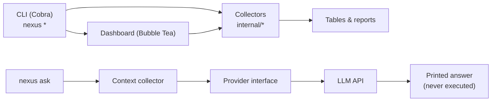

# NEXUS — Developer Command Center

One terminal interface to inspect your dev machine, diagnose problems, and get
AI help. Built with Go for macOS Apple Silicon, portable to Linux.

```bash
go build -o nexus . && ./nexus        # interactive dashboard
./nexus doctor                         # one-shot health check
```

## Demo

> Placeholders — replace with real captures before the public release.


```text
NEXUS DOCTOR
════════════════════════════════

✓ CPU                  PASS
⚠ Memory               WARN
✓ Network              PASS
✓ DNS                  PASS
✓ Docker               PASS
⚠ Git                  WARN

SUMMARY
────────────────────────────────
Passed: 7
Warnings: 6
Failed: 0
```

## Features

- **Interactive dashboard** — Bubble Tea UI with System, Processes, Docker,
  Git, Network, and Doctor screens (`↑/↓` navigate, `Enter` open, `r` refresh,
  `q` quit)
- **System monitoring** — OS, CPU, memory, disk, uptime via gopsutil
- **Process monitor** — top-N table sorted by CPU or memory, read-only
- **Docker inspection** — container table via `docker ps`, graceful when
  Docker is missing
- **Git inspector** — branch, clean/dirty, staged/modified/untracked, latest
  commit via read-only Git commands
- **Network diagnostics** — internet, DNS, latency, interfaces (stdlib only)
- **Doctor** — 13 PASS/WARN/FAIL checks with summary and recommendations,
  never fixes anything automatically
- **Optional AI assistant** — `ask` sends a machine-facts snapshot to an
  OpenAI-compatible API; works fully without a key

## Architecture



`cmd/` wires thin Cobra commands to small `internal/` packages. Each package
separates collection from presentation and degrades to `N/A` / guidance
instead of crashing. The dashboard reuses the same collectors — no duplicate
logic.

## Tech stack

| Layer | Choice |
|---|---|
| Language | Go 1.24+ |
| CLI | Cobra |
| TUI | Bubble Tea + Lip Gloss |
| System/process metrics | gopsutil/v4 |
| Docker/Git | External CLIs via `os/exec` (no SDK deps) |
| Network | Standard library only |
| AI | Standard library HTTP client, OpenAI-compatible API |

## Installation

```bash
git clone <repo-url> nexus && cd nexus
go mod download
go build -o nexus .
```

Requires Go 1.24+ and, optionally, the `docker` and `git` CLIs on `PATH`.
No Docker daemon, repo, or API key is required to run NEXUS.

## Usage

```bash
./nexus                 # interactive dashboard (needs a TTY)
./nexus system          # OS, CPU, memory, disk, uptime
./nexus processes       # top 15 by CPU
./nexus processes --sort memory --limit 20
./nexus docker          # running containers
./nexus docker --all    # include stopped
./nexus git             # repo overview
./nexus git --short     # one-line summary
./nexus network         # internet, DNS, latency, interfaces
./nexus doctor          # full health check
./nexus doctor --ports 3000,5432
./nexus ask "Why is my backend failing?"
```

## CLI commands

| Command | Description |
|---|---|
| `nexus` / `nexus dashboard` | Interactive dashboard (needs a TTY) |
| `nexus system` | System information |
| `nexus processes [--limit N] [--sort cpu\|memory]` | Top processes, read-only |
| `nexus docker [--all]` | Container table, read-only |
| `nexus git [--short]` | Repository overview, read-only |
| `nexus network` | Network diagnostics, read-only |
| `nexus doctor [--ports 3000,5432]` | Health checks, never auto-fixes |
| `nexus ask [--show-context] "<q>"` | AI help, needs API key |

## AI configuration

NEXUS works completely without AI. `ask` activates only when
`NEXUS_OPENAI_API_KEY` is set.

```bash
export NEXUS_OPENAI_API_KEY=<your-key>
./nexus ask "Analyze my current system."
```

| Variable | Purpose | Default |
|---|---|---|
| `NEXUS_OPENAI_API_KEY` | Enables `ask`; empty = disabled | empty |
| `NEXUS_AI_PROVIDER` | Backend (`openai` only) | `openai` |
| `NEXUS_AI_MODEL` | Model name | `gpt-4o-mini` |
| `NEXUS_AI_BASE_URL` | Endpoint override | `https://api.openai.com/v1` |
| `NEXUS_AI_TIMEOUT_SECS` | Request timeout (s) | `60` |
| `NEXUS_DEBUG` | Verbose logging | off |
| `NEXUS_NO_COLOR` / `NO_COLOR` | Plain dashboard styles | off |

The snapshot sent to the model contains machine facts only (OS, resource
usage, container names, branch, connectivity, doctor tally) — never secrets,
env values, or file contents. Keys travel as HTTPS bearer tokens and are
never printed, even in errors.

## Project structure

```text
nexus/
  main.go              entrypoint
  cmd/                 Cobra commands (thin wiring + flags)
  config/              environment-variable configuration
  internal/system/     OS/CPU/memory/disk/uptime
  internal/process/    process table
  internal/docker/     docker ps inspection
  internal/git/        repo overview
  internal/network/    diagnostics
  internal/doctor/     PASS/WARN/FAIL engine
  internal/ai/         provider interface + context collector
  internal/logger/     stderr logger
  ui/                  dashboard (model, loaders, styles)
  docs/                per-phase build reports
```

## Example output

```text
$ ./nexus git --short
main* 8050562 Phase 1: project foundation (M5 S0 U7)

$ ./nexus network
NETWORK
────────────────────────
Internet     ✓
DNS          ✓
Latency      23 ms

INTERFACES
────────────────────────
en0          10.7.16.85
```

## Safety & design principles

- **Read-only by default** — inspectors never start/stop containers, modify
  repos, touch network config, or kill processes
- **Doctor never auto-fixes** — it reports and recommends; you act
- **AI never executes** — answers are printed text, never run
- **Graceful degradation** — missing Docker/Git/network/key yields guidance,
  exit 0; usage errors exit 1; warnings go to stderr, data to stdout
- **No secrets** — env vars only, never hardcoded, never printed
- **Fast and independent** — commands work alone, bounded timeouts everywhere

## Development

```bash
make build   # go build -o nexus .
make run     # go run . --help
make test    # go test ./...
make fmt     # gofmt -w + go vet
make clean   # rm -f nexus
```

## Testing

```bash
go test -count=1 ./...
```

Collectors are built testable (stub CLIs, synthetic snapshots); formatting
and thresholds have unit tests; the dashboard model has navigation tests;
the AI client is tested against a local stub server. Live runs are verified
on macOS arm64; Linux amd64/arm64 builds are verified via
`GOOS=linux go build`.

## Roadmap

Done: dashboard, system, processes, Docker, Git, network, doctor,
optional AI, audit.

Future ideas (not implemented): scrollable dashboard viewport, streaming
`ask` replies, custom `ask` context sections, multi-volume disk details,
`git --path`, configurable doctor thresholds.

## Limitations

- Dashboard needs a real TTY; piped use returns a clear error
- Per-process CPU is a ~200 ms single sample (approximate)
- Doctor collects sequentially (~2 s); `ask` is stateless, no history
- Docker/Git features require those CLIs; only OpenAI-compatible AI APIs

## License

No `LICENSE` file is committed yet — until one is added, all rights are
reserved by the authors. Suggested: MIT for a public open-source release.
